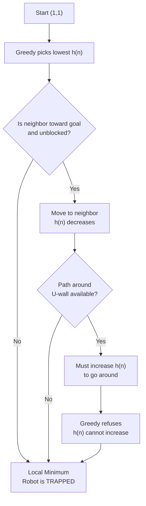
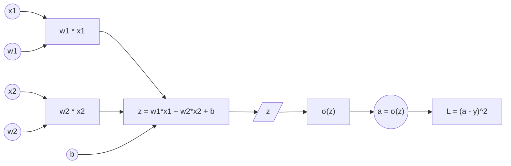

# Assignment Part A: Theory (Assignment-1)
**Student Name:** Atharva Verma
**Roll Number:** 0901AI231019
**Batch:** A  

---

## Question 1: Robot Search in a 10x10 Grid

### a) BFS vs. Best-First Search in an Empty Grid
In a 10x10 grid with no obstacles, starting at (1, 1) and reaching a goal at (10, 10):

*   **Breadth-First Search (BFS):** BFS explores all nodes layer by layer (level-order traversal). It treats every neighbor as equally important. In a grid, this results in a "diamond" or "circular" expansion pattern. BFS will expand almost the entire grid before reaching the goal at the opposite corner, as it explores all nodes with distance $d$ before moving to $d+1$. BFS is **complete** (it will always find a path if it exists) and **optimal** when step costs are uniform.
*   **Best-First Search (Manhattan Distance):** Best-First Search uses a heuristic $h(n) = |x_1 - x_2| + |y_1 - y_2|$ to estimate the cost to the goal. It always picks the node that "looks" closest to (10, 10). In an empty grid, moving Right or Up always reduces the Manhattan distance. Thus, the robot moves in a straight path directly toward the goal, expanding only the minimum number of nodes ($9 + 9 = 18$ steps, visiting exactly **19 nodes** including start and goal).

**Conclusion:** Best-First Search expands significantly fewer nodes because it is "goal-oriented," whereas BFS is "blind" to the goal's location.

### b) The U-Shaped Wall Trap
If a large U-shaped wall is placed in front of the goal at (10, 10):



**State-Space Diagram (1-D Projection of the U-Wall Problem):**
```
State Value (h = distance to goal)
    |
10  |                              ___________
    |                             |           |
    |     __________              |           |
    |    |          |             |           |
 5  |    |          |____________|           |
    |    |          |             |           |
    |    |          |             |           |
 0  |____|__________|_____________|___________|________________
    Start                                      Goal
           \          U-Wall                   /
            \______________________________/
                    (Blocked Path)
```

*   **Heuristic Search Failure:** The Manhattan distance heuristic is "greedy." Inside a U-trap, the robot moves to the point closest to the goal (the bottom of the "U"). Going around the wall requires moving *away* from the goal, which increases the heuristic value — so the algorithm refuses to do it and gets stuck in a **local minimum**.
*   **BFS Success:** BFS explores all directions equally, eventually filling the space inside the "U" and finding the path around. BFS succeeds because it is **complete**: guaranteed to find a path in a finite state space regardless of heuristic misdirection.

---

## Question 2: Maximum Likelihood Estimation (MLE) for a Biased Coin

### a) Mathematical Derivation
Given: 10 flips, 8 Heads ($H=8, T=2$). Let $p$ be the probability of getting a Head.

The Likelihood function for a Bernoulli process is:
$$L(p) = p^H (1-p)^T = p^8 (1-p)^2$$

To maximize $L(p)$, we take the Natural Log (Log-Likelihood):
$$\ln L(p) = 8 \ln(p) + 2 \ln(1-p)$$

Find the derivative with respect to $p$ and set it to zero:
$$\frac{d}{dp} \ln L(p) = \frac{8}{p} - \frac{2}{1-p} = 0$$

Solve for $p$:
$$\frac{8}{p} = \frac{2}{1-p} \implies 8(1-p) = 2p \implies 8 - 8p = 2p \implies 10p = 8 \implies p = 0.8$$

**Verify this is a Maximum (Second Derivative Test):**
$$\frac{d^2}{dp^2} \ln L(p) = -\frac{8}{p^2} - \frac{2}{(1-p)^2}$$

Substituting $p = 0.8$:
$$\frac{d^2}{dp^2} \ln L(p)\bigg|_{p=0.8} = -\frac{8}{(0.8)^2} - \frac{2}{(0.2)^2} = -\frac{8}{0.64} - \frac{2}{0.04} = -12.5 - 50 = -62.5 < 0$$

Since the second derivative is **strictly negative**, $p = 0.8$ is indeed a **strict local maximum** of the likelihood function. If it were zero or positive, we would have a minimum or saddle point instead.

**Result:** The MLE for the probability of a head is 0.8.

### b) Frequentist vs. Bayesian Approach
*   **Frequentist (MLE):** This approach treats the parameter $p$ as a **fixed but unknown constant**. It relies solely on the observed data. Probability is defined as the limiting relative frequency of events. MLE selects the value of $p$ that maximizes the probability of observing the current data.
*   **Bayesian Approach:** This approach treats $p$ as a **random variable** with its own distribution. It incorporates "Prior Beliefs" $P(p)$ (e.g., $Beta(2,2)$ for a fair coin belief) which are updated using Bayes' theorem to find the **Posterior** distribution $P(p|D) \propto P(D|p) \times P(p)$. 
    *   If we had a fair prior, our estimate would pull the result 0.8 back toward 0.5. As the number of observations increases, the influence of the prior vanishes, and the Bayesian estimate converges to the MLE.

---

## Question 3: Computational Graph and Neuron Gradient

### a) Computational Graph for a Single Neuron
A neuron with two inputs ($x_1, x_2$), weights ($w_1, w_2$), bias ($b$), and Sigmoid activation $\sigma(z)$ producing output $a$:



### b) Gradient Calculation (Chain Rule)
We want to find how the error at the output ($L$) changes with respect to the first weight ($w_1$): $\frac{\partial L}{\partial w_1}$.

Assume Mean Squared Error: $L = (a - y)^2$, where $a = \sigma(z)$ and $z = w_1x_1 + w_2x_2 + b$.

Using the Chain Rule:
$$\frac{\partial L}{\partial w_1} = \frac{\partial L}{\partial a} \cdot \frac{\partial a}{\partial z} \cdot \frac{\partial z}{\partial w_1}$$

1.  **Loss to Activation:** $\frac{\partial L}{\partial a} = 2(a - y)$
2.  **Activation to Sum (Sigmoid derivative):** $\frac{\partial a}{\partial z} = \sigma(z)(1 - \sigma(z)) = a(1 - a)$
3.  **Sum to Weight:** $\frac{\partial z}{\partial w_1} = x_1$

**Final Gradient Formula:**
$$\frac{\partial L}{\partial w_1} = 2(a - y) \cdot a(1 - a) \cdot x_1$$
